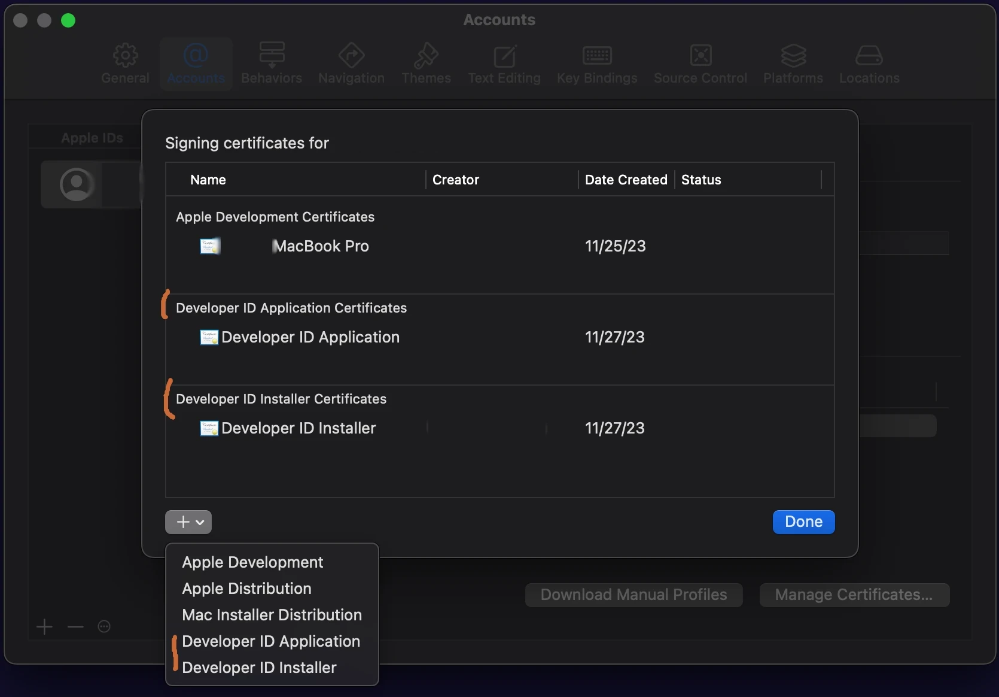

Creating and Signing a PKG installer for MacOS devices is not
hard, but the available resources can be confusing.

In this article, I will detail the steps required to create and sign a pkg
installer for a VST3 plugin. These same steps will also work for an application.
<!--more-->

## PKG vs DMG

First a word about dmg files - another (more) popular choice for independent
developers to use to create installers.

DMG files are disk images. As such, they act as nothing more than elaborate zip file.
There is no way to run a script or anything to do set up. Most DMGs used as
installers consist of the app or plug-in to install and an alias (link) to
the install location. The user drags the application over the link in order to
install it in the proper location.

The good thing about DMGs is that there are multitudes of ways to brand and
customize what the user sees when opening the image. You can change the
background of the folder, the icons used for the app and the link, etc.

The really bad thing about DMGs is that they don't work for plugins. On Sonoma, 
for instance, the OS does not allow the user to simply drag the plug-in over the
link. The user must open the link and then drag the plug-in into the finder
window in order to copy.

Also, the location into which you want to install must exist on the user's
machine. So, for instance, ifyou wanted to install your `CoolPlugin.vst3` into 
`/Library/Audio/Plug-Ins/VST3/CoolStuff`, you cannot do this in an DMG since the
target will most likely not exist on the users machine.

A pkg installer is actually a tiny application in itself that can copy files,
and run setup scripts. It works for plugins.

Creating a pkg install that installs in a subdirectory is trivial.

Making a simple pkg is as easy as making a DMG. 

Best of all, the pkg will work the same (and smoothly) on versions from Catalina
(10.15) to Sonoma (14.1)

So, lets get started.

## Join the Developer Progam

You will need to join the [Apple Developer Program](https://developer.apple.com/account)


- This costs about $100 a year (as of 2023).
- It can take 48 hours to be enrolled.
- You will not be able to do anything until you are enrolled.


You will not be able to create the certificates you need until you are enrolled.

## Create Certificates

You will need two certificates
- Developer ID Application : Used to sign the binaries to assert that you
  created it.
- Developer ID Installer : Used to sign the actual package.

Both of these can be created in `xcode` under `Xcode` > `Settings` in the 
`Accounts` tab.

Click on your Apple ID, and then select `Manage Certificates...` in the lower
right corner.

(Note: Screenshot is under Sonoma (14.1.1))



Click on the "+" in the left hand bottom corner to create the certifications.
If you don't see the two entries in menu, you haven't been enrolled in the
developer program yet.

## Code sign the plugin (or application)

The top level `myplugin.vst3` is a bundle directory (same as an application). 
The actual plugin binary file will be below that in `/Contents/MacOS`. To sign
the bundle, we will sign both the executable directly as well as the top level
bundle.

Before we start, you will need your application id. This can be found by running
```
security find-identity -v -p codesigning
```

It will have the form :
```
"Developer ID Application : <Your Name> (<Team Id>)"
```

You will need the entire string inside the quotes.

Lets assume your plugin is in the current directory as 'myplugin.vst3'

```bash
# Sign the binary
codesign --force -s "$DEVELOPER_ID_APPLICATION" \
          -v "myplugin.vst3/Contents/MacOS/myplugin" \
          --strict --options=runtime --timestamp

#sign the bundle
codesign --force -s "$DEVELOPER_ID_APPLICATION" \
          -v "myplugin.vst3" \
          --strict --options=runtime --timestamp
```

You can look at the signature by using:

```codesign -dvv mypligin.vst3```



Don't use `--deep`. In many articles about signing you will notice that they
use the `--deep` option to the `codesign` tool. Apple recommends not doing that
and has stated that it will be going away at some point. 


## Create the Package

For this, you will need your Installer identity. This looks much like the 
Application identity from about. You can find your installer identity using
`security` again but leaving off the `-p` option.

It will have the form :
```
"Developer ID Installer : <Your Name> (<Team Id>)"
```

```bash
pkgbuild --component "myplugin.vst3" \
         --install-location "/Library/Audio/Plug-Ins/VST3/CoolStuff" \
         --sign "$DEVELOPER_ID_INSTALLER" \
         myplugin-unsigned.pkg
```

The `--component` option is the path and filename of the plug-in (or
application) that will be installed. There are ways to add multiple components,
but we'll keep it simple for now.

The `-install-location` option is where to put the component on the user's
system. Note that I showed this going into a subdirectory of VST3 rather than
directly into it. This is not required, but does show the versatility of the
pkg format.

`--sign` is the your installer identity.

The final parameter is the file name for the package. Note that I specifically
marked it as "unsigned" to help keep confusion down.

## Sign the package

`productbuild` can do a lot of things including dding more bundles to the the
pkg. We are simply going to using to turn the product archive created by
 `pkgbuild` into a deployable archive.

 ```bash
  productbuild --package myplugin-unsigned.pkg \
               --sign "$DEVELOPER_ID_INSTALLER" \
               myplugin.pkg
 ```

 This takes the "unsigned" package and returns the signed package.

## Notarize and Staple

Signing is the process of telling the world that you created the contents.

Notarizing is the process of Apple telling the world that, yes, you indeed
created it and that they could not detect malware.

Stapling is the process of inserting the affidavit from Apple into the pkg so
that it is available to anyone how has the pkg file. This allow the user's
system to query Apple on the validity of the signing.

You will need two additional things:

- Your team id : This is the string of letters and numbers in the parentheses
  at the end of the installer identity.

- An Application Specific Password : go to https://appleid.apple.com/account/manage
  and choose "App-Specific Passwords" in the lower right.

```bash
# Notarize. --wait tells the tool to hang around until Apple's
# servers return the notarization information.
xcrun notarytool submit "myplugin.pkg" \
            --apple-id "$APPLE_ID" \
            --password "$APP_SPECIFIC_PASSWORD" \
            --team-id "$TEAM_ID" --wait

# Add the seal to the pkg.
xcrun stapler staple "myplugin.pkg"
```
And thats it! 

At this point the pkg file is ready to be uploaded onto your website and
shared with the world.

## Setting up CI

But we are software engineers, so we want to do this on a regular basis using 
GitHub Actions, or gitlab, or Jenkins or some other CI solution.

The main problem with CI is that the signing certificates that are so readily
available on your MocOS machine need to placed into the CI environment. To do
so, we will need to export the certs, set up secrets, and then import the certs
into the CI environment

### Exporting Certificates

Back in `xcode`, in `Manage Certificates...`, you can right click on each
of the two certificates and request to export them.

As you export, you will be requested to supply a password for each certificate.
Make note of those. You will need them later.

After you a exported the certificates, you will want to base64 encode them.
While not strictly necessary, it help keep weirdness at bay as the strings
filter through all the layers of shell interpolation, etc.

```bash
base64 -i dev_id_app.p12 -o dev_id_app.b64
```

### Secrets

After gathering all the data you will need to create a set of secrets to use
int the CI scripts. In GitHub, this would be done at the repository level in the
`settings` > `Secrets and variables` > `Actions` area.

|Name                    |Value                                            | 
|------------------------|-------------------------------------------------|
| DEVELOPER_ID_APPLICATION |The string that start "Developer ID Application ..." Again, don't put in the quotes. |
| DEVELOPER_ID_INSTALLER   | The string that start "Developer ID Installer ..." Again, don't put in the quotes. |
| DEV_ID_APP_CERT | The **contents** (not filename) of the base64 cert |
| DEV_ID_APP_PASS | The password you specified when exporting |
| DEV_ID_INST_CERT | The **contents** (not filename) of the base64 cert |
| DEV_ID_INST_PASS | The password you specified when exporting |
| NOTARIZE_ID | Your Apple ID |
| NOTARIZE_PASS | The app-specific passord you created |
| KEYCHAIN_PASS | A random password for the created keychain - more below |

For DEV_ID_APP_CERT and DEV_ID_INST_CERT, you will need to put in the
**contents** of those certificates. The easiest way to do this to use
`pbcopy` to get the contents into the paste buffer.

```cat dev_id_app.b64 | pbcopy```

As we will see in a moment, importing the certs into the CI environment requires
creating a temporary keychain. `KEYCHAIN_PASS` is the password that will be
assigned.

### Importing Certificates

If you are using GitHub Workflows, there is an action available to import the
certs. The steps will look like so

```yaml
    - name: Import APP Certificates 
      uses: apple-actions/import-codesign-certs@v2
      with:
        keychain-pass : ${{ secrets.KEYCHAIN_PASS }}
        p12-file-base64: ${{ secrets.DEV_ID_APP_CERT }}
        p12-password: ${{ secrets.DEV_ID_APP_PASS }}

    - name: Import INST Certificates 
      uses: apple-actions/import-codesign-certs@v2
      with:
        keychain-pass : ${{ secrets.KEYCHAIN_PASS }}
        create-keychain : false
        p12-file-base64: ${{ secrets.DEV_ID_INST_CERT }}
        p12-password: ${{ secrets.DEV_ID_INST_PASS }}
```

If you are on another CI system, or just want to open code it, the script looks
like :

```bash
        cert_tmp_dir=$(mktemp -d -t "certs.XXXXXX" ) || exit 1
        echo "${{secrets.DEV_ID_APP_CERT}}" | base64 -d -i - -o ${cert_tmp_dir}/app_cert.p12
        echo "${{secrets.DEV_ID_INST_CERT}}" | base64 -d -i - -o ${cert_tmp_dir}/install_cert.p12

        /usr/bin/security create-keychain -p "${{secrets.SKEYCHAIN_PASS}}" signing_temp.keychain
        /usr/bin/security set-keychain-settings -lut 3600 signing_temp.keychain
        /usr/bin/security unlock-keychain -p "${{secrets.KEYCHAIN_PASS}}" signing_temp.keychain

        /usr/bin/security import ${cert_tmp_dir}/app_cert.p12 \
          -k signing_temp.keychain -f pkcs12 -A -T /usr/bin/codesign -T /usr/bin/security \
          -P "${{secrets.DEV_ID_APP_PASS}}"
    
        /usr/bin/security import ${cert_tmp_dir}/install_cert.p12 \
            -k signing_temp.keychain -f pkcs12 -A -T /usr/bin/codesign -T /usr/bin/security \
            -P "${{secrets.DEV_ID_INST_PASS}}"
    
        /usr/bin/security set-key-partition-list -S apple-tool:,apple: \
          -k "${{secrets.KEYCHAIN_PASS}}" signing_temp.keychain
    
        /usr/bin/security list-keychains -d user -s signing_temp.keychain login.keychain
```

Here is a [worked out CI example in GitHub](https://github.com/SolidFuel/Utility/blob/Develop/.github/workflows/macos-release.yml).

## Final Thoughts

Apple has changed code signing quite bit over the last few years. The entire
process is now quite a bit easier and less paperworky.

There really should not be a reason NOT to sign your pkg files.

## Other Resources
- [Another article on signing](https://melatonin.dev/blog/how-to-code-sign-and-notarize-macos-audio-plugins-in-ci/)
- [Worked out CI example in GitHub](https://github.com/SolidFuel/Utility/blob/Develop/.github/workflows/macos-release.yml)
- [Apple's description of codesign](https://developer.apple.com/library/archive/documentation/Security/Conceptual/CodeSigningGuide/Procedures/Procedures.html)
  2/3rds of the way down, there is box with **Important** that talks about (not) 
  using `--deep` for signing.
- [Thread on Juce forums about DMGs](https://forum.juce.com/t/dmg-with-symlinks-to-library-audio-plug-ins/52161/15)